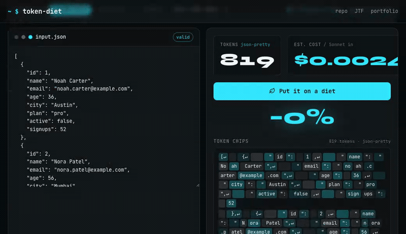

English · [Русский](README.ru.md)

> ▶ **Live playground** — paste JSON, watch the token count drop: **https://k1y0miiii.github.io/token-diet/**

[](https://k1y0miiii.github.io/token-diet/)

# token-diet

[](https://github.com/k1y0miiii/token-diet/actions/workflows/ci.yml)
[](LICENSE)
[](https://www.python.org/)

> **Put your LLM payloads on a token diet.** The same data, measured in every encoding — so you stop guessing and start cutting your token bill.

Most apps send LLMs pretty-printed JSON. That is the most expensive way to ship structured data. **token-diet** measures, for real, how many tokens the *same* data costs across encodings (minified JSON, short keys, [JTF](https://github.com/k1y0miiii/jtf), CSV/TSV, YAML) — with a reproducible leaderboard. Numbers are counted with `tiktoken`, never invented.

## Leaderboard (really measured)

<!-- BENCH:BEGIN -->
Tokenizer `cl100k_base` (GPT-3.5 / GPT-4), baseline `json-pretty`, summed across 6 bundled datasets. Measured with tiktoken — reproduce with `token-diet bench`.

| Encoding | Tokens | %vsJSON | Lossless | Notes |
|---|---:|---:|:---:|---|
| `jtf` | 8533 | -39.8% | yes | summed over all datasets |
| `json-min` | 8709 | -38.5% | yes | summed over all datasets |
| `json-shortkeys` | 8939 | -36.9% | yes | summed over all datasets |
| `yaml` | 10829 | -23.6% | yes | summed over all datasets |
| `json-pretty` | 14170 | baseline | yes | summed over all datasets |
| `csv` | N/A | - | - | N/A for at least one dataset |
| `tsv` | N/A | - | - | N/A for at least one dataset |
<!-- BENCH:END -->

Reproduce in one command:

```bash
python3 -m pip install -e ".[dev]"
token-diet bench
```

## Why

- **Token bills scale with tokens.** Pretty JSON is ~2× the bytes of minified, and structured-table formats can be far cheaper still for arrays of objects.
- **Context windows are finite.** Fewer tokens per payload = more room for the actual reasoning.
- **People guess.** "Minify it, probably helps?" — token-diet replaces the guess with a measured number for *your* data shape.

## How it works (reproducible)

Every encoder serializes the **same** parsed JSON, then we count tokens with `tiktoken`. The baseline is `json-pretty` (indent=2) — what most apps actually send. Everything is honest:

- `lossless` is verified by real round-trip `decode(encode(x)) == x` wherever a decoder exists (JSON variants, JTF, CSV/TSV for flat tables).
- The short-keys **map** and the CSV **header** travel with the payload and are counted in the tokens. Nothing is hidden to flatter a format.
- Encodings that do not apply to a data shape (e.g. CSV on nested data, YAML without `pyyaml`) are marked **N/A**, never given a fake number.

> Token counts use `tiktoken` (GPT-family: `cl100k_base` for GPT-3.5/4, `o200k_base` for GPT-4o/o-series) as a proxy. Claude and other models tokenize differently — for exact Claude counts use [`llmcost --api`](https://github.com/k1y0miiii/llmcost).

### Encodings benchmarked

| Encoding | What it is | Lossless | Needs a parser on the other end? |
|---|---|:---:|:---:|
| `json-pretty` | `indent=2` — the baseline most apps send | yes | no (native) |
| `json-min` | minified, `separators=(",",":")` | yes | no (native) |
| `json-shortkeys` | minified + a lossless key→short map (map counted) | yes | yes (apply the map) |
| `jtf` | [JSON Token Format](https://github.com/k1y0miiii/jtf), the real vendored encoder | yes | yes (JTF decoder) |
| `csv` / `tsv` | flat arrays-of-objects only; N/A otherwise | for string cells | yes |
| `yaml` | human-readable; usually *more* tokens than JSON | yes | yes |

## Reproduce

```bash
# 1. install (editable, with dev tools)
python3 -m pip install -e ".[dev]"

# 2. full leaderboard (all datasets, cl100k_base)
token-diet bench

# 3. switch tokenizer family (GPT-4o / o-series)
token-diet bench --tokenizer o200k_base

# 4. one dataset, write machine-readable artifacts
token-diet bench --dataset users --json --md
#   -> results/results.json, results/leaderboard.md

# 5. regenerate the table in this README (never hand-typed)
token-diet bench --update-readme

# 6. put YOUR OWN file on a diet
token-diet diet path/to/your.json
```

`pyyaml` is optional — install it to include the `yaml` row:

```bash
python3 -m pip install -e ".[dev,yaml]"
```

## Daily use: `token-diet diet`

Point it at your own payload and see the win immediately:

```text
$ token-diet diet datasets/users.json
file      : datasets/users.json
tokenizer : cl100k_base (GPT-3.5 / GPT-4)
baseline  : json-pretty = <N> tokens

ENCODING          TOKENS   %vsJSON  LOSSLESS NOTES
...
best lossless   : jtf (<N> tokens, ... = ...% vs JSON)  <- recommended
```

## Playbook — cut your LLM token bill

The distilled, copy-paste tactics, **biggest wins first**. See [PLAYBOOK.md](PLAYBOOK.md) for the full version with trade-offs. Honest rule: **measure, don't guess** — run `token-diet diet your.json` before committing to a format.

| # | Tactic | Rough impact | Lossless? | Human-readable? | Needs a parser? |
|---|---|---|:---:|:---:|:---:|
| 1 | **Tabular for arrays-of-objects** (JTF / CSV) — drop repeated keys | large on row-heavy data | yes (JTF) / string-only (CSV) | partly | yes |
| 2 | **Minify JSON** — kill indentation & spaces | medium, free | yes | less | no |
| 3 | **Drop nulls / empty fields** before sending | medium | lossy (by design) | yes | no |
| 4 | **Shorten repeated keys** with a map | medium when keys repeat | yes (with map) | no | yes |
| 5 | **Web → clean text** instead of raw HTML | up to ~8× on web content | lossy | yes | yes |
| 6 | **Prompt caching** — cache the stable prefix | huge on repeated calls | n/a | n/a | n/a |
| 7 | **Context hygiene** — send only what the task needs | varies, often large | n/a | n/a | n/a |
| 8 | **Structured outputs** — constrain the *response*, not just input | medium | n/a | n/a | n/a |

- **Web → clean text:** raw HTML is mostly tags and noise. Extracting clean text/markdown can cut ~8× — see [glyph-mcp](https://github.com/k1y0miiii/glyph-mcp).
- **Exact Claude costs:** tiktoken is a GPT proxy. For real Claude API token/price accounting, use [llmcost](https://github.com/k1y0miiii/llmcost).

## Credits & ecosystem

Built by **Maxim Chumakov** ([@k1y0miiii](https://github.com/k1y0miiii)).

- [json-token-format (JTF)](https://github.com/k1y0miiii/jtf) — the lossless, token-efficient JSON encoding benchmarked here (vendored).
- [glyph-mcp](https://github.com/k1y0miiii/glyph-mcp) — web → clean text for LLMs (~8× fewer tokens on web pages).
- [llmcost](https://github.com/k1y0miiii/llmcost) — exact LLM token & price accounting, including Claude via `--api`.

## License

MIT © 2026 Maxim Chumakov. The vendored `token_diet/vendor/jtf.py` is the JTF reference encoder, also MIT.
